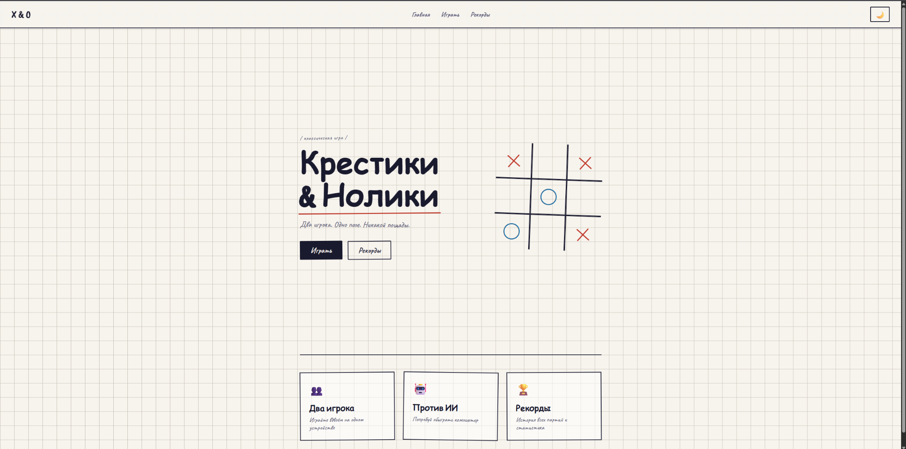
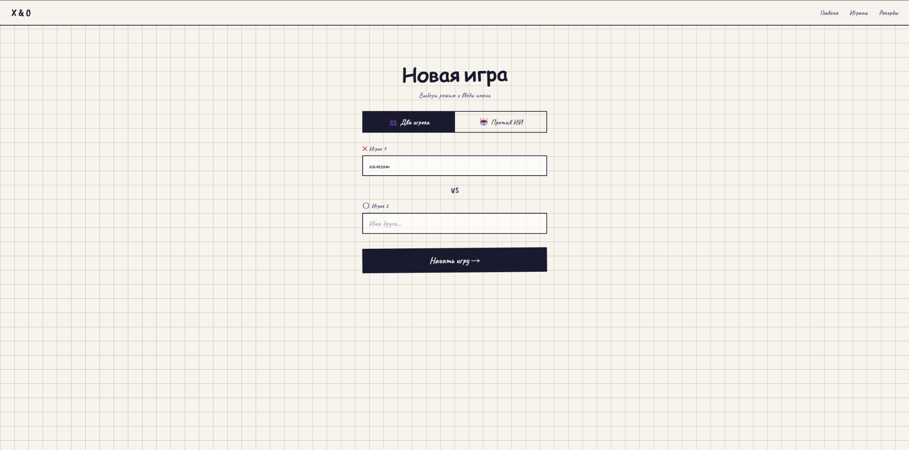
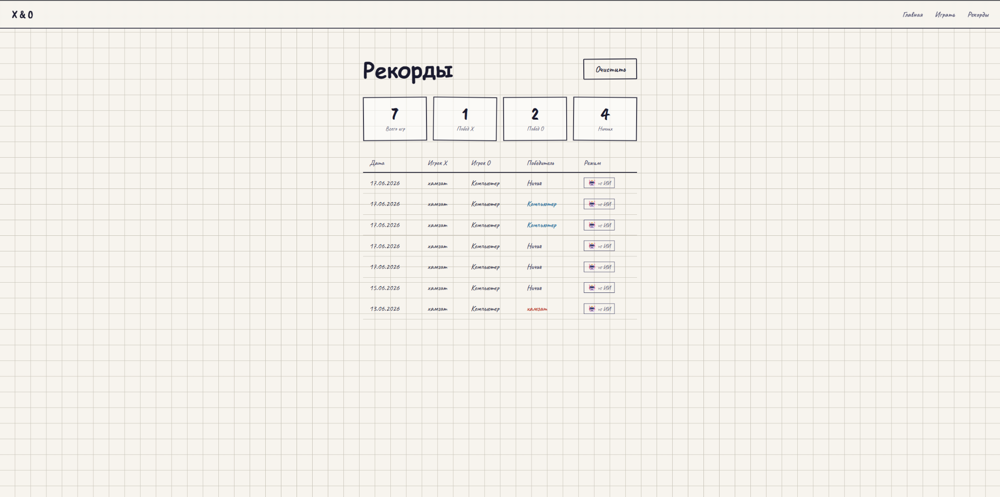

# 🎮 Tic-Tac-Toe

Современная веб-реализация классической игры «Крестики-нолики» с поддержкой игры против другого игрока или искусственного интеллекта, системой сохранения результатов и статистикой сыгранных матчей.

## 🌐 Демонстрация проекта

**GitHub Pages:**

https://khamzatjr.github.io/tic-tac-toe/

## 📹 Видео работы проекта

Видео демонстрации доступно через QR-код:


Также ссылка на видео находится в файле `VIDEO.md`.

---

## ✨ Возможности

- Игра в режиме «Игрок против Игрока»
- Игра против искусственного интеллекта
- Ввод имён игроков
- Автоматическое определение победителя
- Определение ничьей
- Сохранение истории матчей
- Страница рекордов и статистики
- Подсчёт побед каждого игрока
- Очистка истории игр
- Адаптивный пользовательский интерфейс
- Тёмная и светлая темы оформления

---

## 🛠 Используемые технологии

### Frontend

- HTML5
- CSS3
- JavaScript (ES6)

### Хранение данных

- LocalStorage

### Инструменты разработки

- Git
- GitHub
- GitHub Pages

---

## 📂 Структура проекта

```text
tic-tac-toe/
│
├── css/
│   ├── game.css
│   ├── index.css
│   ├── mode.css
│   ├── records.css
│   └── style.css
│
├── js/
│
├── img/
│
├── index.html
├── mode.html
├── game.html
├── records.html
│
├── VIDEO.md
└── README.md
```

---

## 📸 Скриншоты

### Главная страница



### Создание новой игры



### Таблица рекордов



---

## 🎯 Игровые режимы

### 👥 Игрок против Игрока

Два пользователя играют на одном устройстве по очереди.

### 🤖 Игрок против ИИ

Пользователь играет против встроенного компьютерного соперника.

---

## 📊 Система статистики

После завершения каждой партии сохраняется:

- Дата игры
- Имя игрока X
- Имя игрока O
- Победитель
- Режим игры

На странице рекордов отображается:

- Общее количество игр
- Победы X
- Победы O
- Количество ничьих
- История всех сыгранных партий

---

## 🚀 Запуск проекта

### Локальный запуск

1. Клонировать репозиторий:

```bash
git clone https://github.com/khamzatjr/tic-tac-toe.git
```

2. Перейти в папку проекта:

```bash
cd tic-tac-toe
```

3. Открыть файл:

```text
index.html
```

в любом современном браузере.

---

## 👨‍💻 Автор

Хамзат Мамилов

Проект выполнен в учебных целях для практики веб-разработки, работы с JavaScript, DOM и LocalStorage.

---

## 📄 Лицензия

Проект распространяется исключительно в образовательных целях.